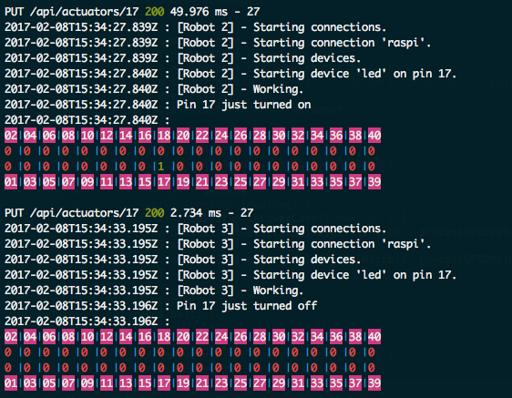

# Cylon JS Raspi Stub implementation
Just a dummy implementation of cylon js raspi to be able to test in development environments

Rigth now it stubs a few drivers like:

- direct-pin
- led (paritally implemented)

It stores an in memory representation of a GPIO as an array of pins that you can print to see the current status:

